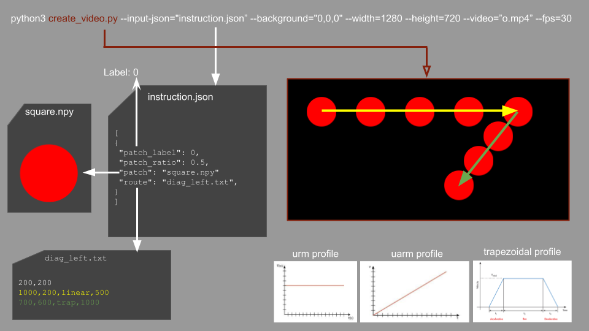

# genvid-minimal

A minimal video (dataset) generator for OD purposes.

## Installation

### Virtualenv

If not installed, install:
```
pip install virtualenv
```
Then create the env:
```
virtualenv venv
source venv/bin/activate
pip install -r requirements.txt
```

### Pip

Tested with python 3.8 and 3.10 
```
pip install -r requirements.txt
```

### Docker

TODO: create docker

## Usage

The main script is **create_dataset.py** which uses src/simulator.py to create the dataset sequences.

A simple example can be found by running ` ./run_simple_example.sh `.

A full example here:

```
python3 create_dataset.py   --background="0,0,0" --width=1280 --height=720 --input-json="i2.json" --fps=30
                            --background="bg1.png"
```

All paths can be passed as static, relative to current dir or relative to own dir:

```
├── create_dataset.py
├── sequences
│   └── example_2_figures.json
├── patches
│   ├── circle.png
│   └── square.npy
├── routes
│   ├── diag_right.txt
│   └── letter_l.txt
```
## How it works

A sequence video is made by moving a list of objects (patches like 3D ndarray or an image) inside a frame (video size) with certain settings (sequence json file) following a path (txt route file).

